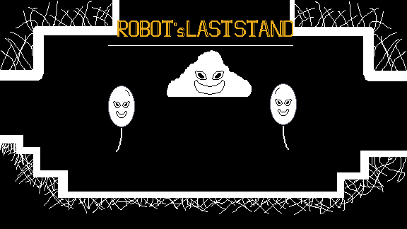

# Robot's Last Stand

> Um robo que se defende de inimigos que querem te deteriorar com um guada-chuva.

## Sobre o projeto

Robot's Last Stand é um roguelike 2D desenvolvido utilizando Godot Engine.

O projeto foi desenvolvido para a jame gam #51, com o objetivo de me preparar para a GMTK 25.

## Meu trabalho

Fui responsável por:

- Programação das mecânicas de gameplay;
- Sistema de movimentação e combate;
- Implementação dos inimigos;
- Gerenciamento do estado do jogo;
- Interface de usuário;
- Integração e exportação para HTML5.

## Gameplay

Enquanto você se esquiva de projéteis que vem em sua direção devolva o ataque nos inimigos. Depois escolha cartas de melhorias para facilitar a jogatina enquanto a horda de inimigos aumenta.

## Tecnologias

- **Engine:** Godot 4.4 -> 4.6
- **Linguagem:** GDScript
- **Arte:** Aseprite

## Como jogar

### Controles

| Esquerda | A |

| Direita | D |

| Pular | Space |

| Bater/Selecionar | LMB |

### Jogar

Link para jogar: https://ninbax-303.itch.io/robots-last-stand

## Imagens

## Créditos

- **Ninbax** — Developer

## Licença

MIT License
